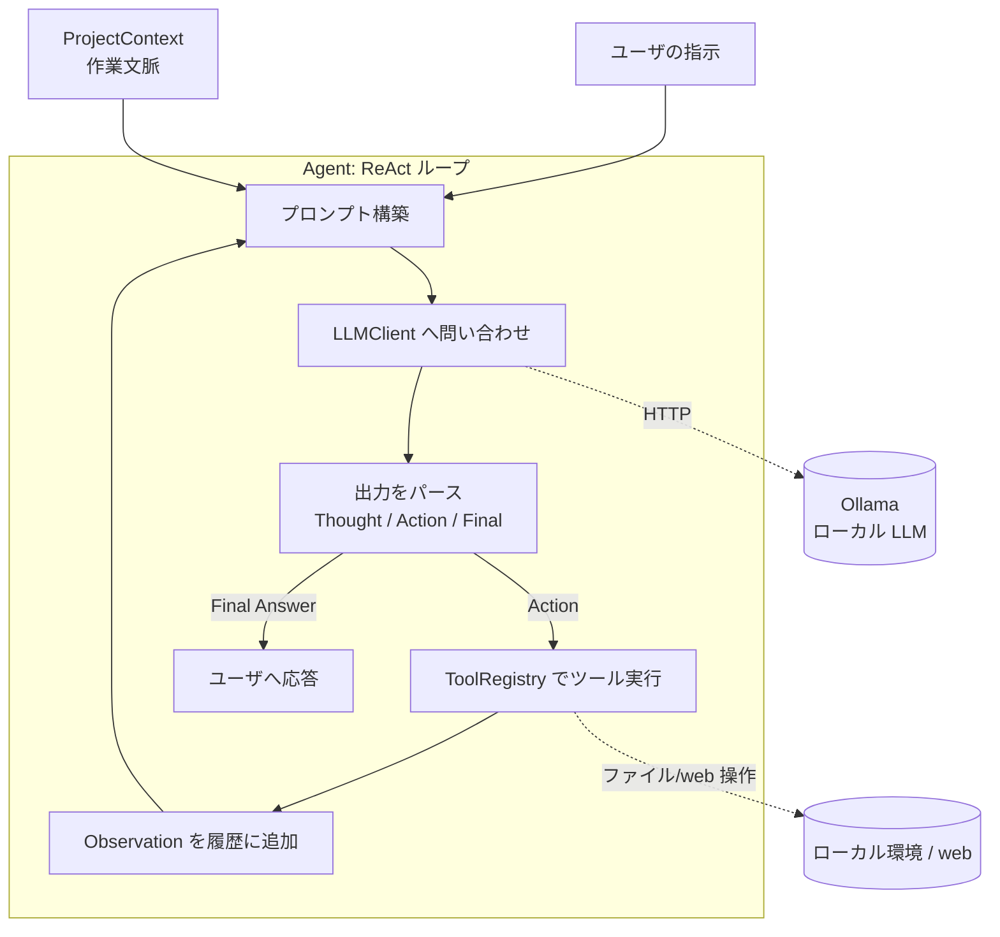

# CreateAI 設計ドキュメント

> 本ドキュメントは、CreateAI エージェントのアーキテクチャ設計をまとめたものです。
> Slack(#情報共有) での一色さん・伴さんの議論で合意した方向性に基づいています。
> **本リポジトリは現時点では設計のみ**で、コード実装は次フェーズ以降に行います。

---

## 1. 概要 / ビジョン

CreateAI は、**Grammarly のように複数のアプリを跨いでユーザに付いてくる AI エージェント**を目指すプロジェクトです。

特定の 1 アプリの中に閉じるのではなく、ユーザの「いま行っている作業」を横断的に理解し、
ユーザの自然言語による指示を、実際の環境への一連の操作へと変換して代行します。

### 代表的なユースケース（フラッグシップ例）

> ユーザが web 上で「**このファイルを今進めてるプロジェクトにダウンロードして**」と指示する。

このとき CreateAI は:

1. web 上の対象ファイルを特定し、ダウンロードする
2. 「今進めているプロジェクト」がどれかを文脈から推測する
3. そのプロジェクトの中で、**尤もらしいディレクトリ**（例: 画像なら `assets/`、データなら `data/`）を **LLM の推論で決定**して配置する

この「**アプリを跨いで、推論でユーザの意図を補完する**」点が CreateAI の中核的な価値です。

### UX のイメージ（Grammarly 型）

- ユーザが普段使うアプリ（web ブラウザ、エディタ、ファイラ等）の傍らに常駐する
- ユーザの作業文脈（今開いているプロジェクト、最近触ったファイル）を保持する
- 明示的な「アプリ切り替え」をユーザに強いず、エージェント側がアプリ境界を越えて動く

---

## 2. ゴールと非ゴール

### ゴール

- **既存のローカル LLM を「頭脳」として使う**エージェントを設計する（自前モデル学習はしない）
- **思考 → 行動 → 観察（ReAct ループ）**で、LLM にツールを反復的に使わせる
- **アプリを跨ぐ操作**（web からの取得 → ローカルプロジェクトへの配置）を、推論を介して実現する
- 拡張しやすい**ツール機構**を持ち、新しい能力をツール追加だけで足せるようにする

### 非ゴール（今回／当面やらないこと）

- **ニューラルネットワークの自前学習・訓練**（NN はやらない、と合意済み）
- 大規模なマルチエージェント分散システム
- クラウド LLM への依存（まずはローカル LLM = Ollama を前提にする）
- 本ドキュメント段階での実コード実装・CI/テスト基盤の構築

---

## 3. アーキテクチャ全体像

CreateAI は、**ReAct（Reasoning + Acting）ループ**を中心に据えます。
LLM は「次に何をすべきか」を**思考(Thought)**し、使うツールを**行動(Action)**として出力します。
ツールの実行結果は**観察(Observation)**として LLM に差し戻され、これを目標達成まで繰り返します。



### 各層の責務

| 層 | 責務 |
|----|------|
| **Agent** | ReAct ループの制御。プロンプト構築・LLM 呼び出し・出力パース・ツール実行のオーケストレーション・終了判定 |
| **LLMClient** | ローカル LLM（Ollama）への問い合わせを抽象化。プロンプト → 生成テキストの変換のみを担当 |
| **ToolRegistry / Tool** | エージェントが使える能力の登録・検索・実行。各ツールは名前・説明・引数スキーマ・実行関数を持つ |
| **ProjectContext** | 「今進めているプロジェクト」を表現する作業文脈。配置先推論などの入力になる |

---

## 4. コンポーネント設計

### 4.1 `LLMClient`（LLM 抽象）

ローカル LLM への問い合わせを 1 か所に閉じ込めるインターフェース。
**将来別ランタイムに差し替え可能**にしておくことで、Ollama 以外（llama.cpp / LM Studio / クラウド）への移行コストを下げます。

```python
class LLMClient(Protocol):
    def generate(self, prompt: str, *, stop: list[str] | None = None) -> str:
        """プロンプトを渡し、生成テキストを返す。"""

class OllamaClient:
    """Ollama の HTTP API (http://localhost:11434) を叩く実装。"""
    def __init__(self, model: str = "llama3", base_url: str = "http://localhost:11434"): ...
    def generate(self, prompt: str, *, stop=None) -> str: ...
```

- まずは `/api/generate`（または OpenAI 互換 `/v1/chat/completions`）を素直に叩く
- `stop` シーケンスで「Observation:」以降の LLM の暴走（ツール結果の捏造）を止める
- ストリーミングは Phase 1 では非対応でよい（同期 1 回応答で十分）

### 4.2 `Agent`（ReAct ループ本体）

```python
class Agent:
    def __init__(self, llm: LLMClient, tools: ToolRegistry, context: ProjectContext): ...

    def run(self, user_instruction: str, *, max_steps: int = 10) -> str:
        """ユーザ指示を受け、ReAct ループを回して最終応答を返す。"""
```

ループ内でやること:

1. **プロンプト構築** — システムプロンプト + ツール一覧 + `ProjectContext` + これまでの (Thought/Action/Observation) 履歴 + 今回のユーザ指示
2. **LLM 呼び出し** — `llm.generate(...)`
3. **出力パース** — `Thought:` / `Action:` / `Action Input:` / `Final Answer:` を抽出
4. **分岐**
   - `Action` があれば → `ToolRegistry` で該当ツールを実行 → 結果を `Observation:` として履歴に追加 → 1 に戻る
   - `Final Answer` があれば → ループを抜けてユーザへ返す
5. **終了条件** — `Final Answer` 到達、`max_steps` 到達、致命的エラーのいずれか

### 4.3 `Tool` と `ToolRegistry`

```python
@dataclass
class Tool:
    name: str                       # 例: "download_file"
    description: str                # LLM がいつ使うべきか判断するための説明
    parameters: dict                # JSON Schema 形式の引数定義
    func: Callable[..., str]        # 実行関数。結果は文字列(Observation)で返す

class ToolRegistry:
    def register(self, tool: Tool) -> None: ...
    def get(self, name: str) -> Tool: ...
    def render_for_prompt(self) -> str:  # ツール一覧をプロンプト用テキストに整形
        ...
    def invoke(self, name: str, arguments: dict) -> str:  # 実行し Observation を返す
        ...
```

- ツールは**疎結合**。新能力はここに `register` するだけで増やせる
- 実行時例外は捕捉し、失敗内容を `Observation` として LLM に返す（LLM がリトライ・別手段を選べるように）

### 4.4 `ProjectContext`（作業文脈）

「今進めているプロジェクト」を表現する。アプリ跨ぎ推論の中核入力。

```python
@dataclass
class ProjectContext:
    root: Path                      # プロジェクトのルートディレクトリ
    recent_files: list[Path]        # 最近触ったファイル（任意）
    description: str | None = None  # プロジェクトの説明（任意）

    def directory_tree(self, max_depth: int = 2) -> str:
        """配置先推論に渡すための、ディレクトリ構造の要約。"""
```

- Phase 1 では「カレントの作業ディレクトリ」を簡易的に current project とみなす
- Phase 2 以降で、複数アプリのシグナル（最近開いたウィンドウ等）から自動推定する余地を残す

---

## 5. ツール設計（初期セット）

| ツール | 引数 | 役割 |
|--------|------|------|
| `download_file` | `url: str`, `dest: str?` | web からファイルを取得し、一時/指定先に保存。保存パスを Observation で返す |
| `place_file` | `file: str`, `project: str?` | **配置先ディレクトリを LLM 推論で決定**してファイルを移動（フラッグシップ機能） |
| `list_directory` | `path: str` | ディレクトリの中身を列挙（推論や確認のため） |
| `read_file` | `path: str` | ファイル内容を読む |
| `write_file` | `path: str`, `content: str` | ファイルに書き込む |

### `place_file` の推論（フラッグシップ機能）

`place_file` は単純な移動ではなく、**「どこに置くのが尤もらしいか」を LLM に推論させる**点が肝です。

1. `ProjectContext.directory_tree()` で現在のディレクトリ構造を取得
2. ファイル名・拡張子・（必要なら）中身の冒頭を特徴量にする
3. LLM に「この構造のプロジェクトで、このファイルはどのディレクトリに置くのが自然か」を問う
4. 返ってきた配置先ディレクトリへファイルを移動し、結果を Observation で返す

> セキュリティ上、移動先は `ProjectContext.root` 配下に限定する（ルート外への配置は拒否）。

---

## 6. フラッグシップ例のウォークスルー

ユーザ指示: **「この画像 https://example.com/logo.png を今のプロジェクトにダウンロードして」**

| ステップ | 種別 | 内容 |
|---------|------|------|
| 1 | Thought | 「まず web からファイルを取得する必要がある」 |
| 1 | Action | `download_file` / `{"url": "https://example.com/logo.png"}` |
| 1 | Observation | `/tmp/logo.png に保存しました` |
| 2 | Thought | 「次にこのファイルを現在のプロジェクトの適切な場所へ置く」 |
| 2 | Action | `place_file` / `{"file": "/tmp/logo.png"}` |
| 2 | (内部) | `ProjectContext` の構造を見て LLM が「画像 → `assets/images/`」と推論 |
| 2 | Observation | `/home/user/myproj/assets/images/logo.png に配置しました` |
| 3 | Final Answer | 「`assets/images/logo.png` に配置しました。」 |

このように、**web（アプリ A）→ ローカルプロジェクト（アプリ B）を跨ぎ、配置先は推論で補完**される、という CreateAI の中核体験が成立します。

---

## 7. プロンプト設計

### ReAct システムプロンプト雛形

```
あなたはユーザの作業を代行する AI エージェントです。
利用可能なツールを使い、思考(Thought)→行動(Action)→観察(Observation) を繰り返して
ユーザの指示を達成してください。

# 現在のプロジェクト文脈
{project_context}

# 利用可能なツール
{tools}

# 出力フォーマット（厳守）
Thought: <次に何をすべきかの思考>
Action: <ツール名>
Action Input: <JSON 形式の引数>

ツールが不要になったら、以下を出力して終了してください:
Thought: <最終的な判断>
Final Answer: <ユーザへの回答>
```

### 出力パース方針

- 行頭の `Thought:` / `Action:` / `Action Input:` / `Final Answer:` ラベルで分割
- `Action Input` は JSON としてパース。失敗時は「JSON が不正」という Observation を返して再試行させる
- `stop=["Observation:"]` を LLM に渡し、**ツール結果を LLM 自身が捏造しない**ようにする
- パース失敗・不正ツール名は致命扱いにせず、Observation でフィードバックして自己修正を促す

---

## 8. ディレクトリ / モジュール構成案

```
CreateAI/
├── README.md
├── docs/
│   └── design.md            # 本ドキュメント
├── pyproject.toml           # （次フェーズ）依存・パッケージ定義
├── createai/
│   ├── __init__.py
│   ├── agent.py             # Agent（ReAct ループ）
│   ├── llm.py               # LLMClient / OllamaClient
│   ├── context.py           # ProjectContext
│   ├── prompts.py           # システムプロンプト・整形
│   ├── parsing.py           # LLM 出力パース
│   └── tools/
│       ├── __init__.py
│       ├── base.py          # Tool / ToolRegistry
│       ├── download.py      # download_file
│       ├── place.py         # place_file（推論配置）
│       └── files.py         # list_directory / read_file / write_file
├── examples/
│   └── download_to_project.py   # フラッグシップ例の実行スクリプト
└── tests/                   # （次フェーズ）
```

> 上記の `createai/` 以下は**次フェーズの実装の指針**であり、本フェーズでは作成しません。

---

## 9. 技術スタックと依存

| 項目 | 採用 | 備考 |
|------|------|------|
| 言語 | **Python**（3.10+ 想定） | エージェント/LLM 開発の標準 |
| ローカル LLM ランタイム | **Ollama** | `http://localhost:11434` の HTTP API。`llama3` 等を想定 |
| HTTP クライアント | `httpx` または標準 `urllib` | Ollama 呼び出し・ファイル DL に使用 |
| パッケージ管理 | `pyproject.toml`（次フェーズ） | 最小依存方針 |

**最小依存方針**: まずは標準ライブラリ + 薄い HTTP クライアントのみで構成し、
重厚なエージェントフレームワーク（LangChain 等）には当面依存しない。
ReAct ループは自前で持ち、挙動を完全に制御できる状態を優先する。

---

## 10. ロードマップ（段階）

### Phase 1 — 単一マシン上で動く ReAct エージェント
- `LLMClient`(Ollama) / `Agent` / `Tool`+`ToolRegistry` / `ProjectContext` の最小実装
- ツール: `download_file`, `place_file`, `list_directory`, `read_file`, `write_file`
- フラッグシップ例（web → ローカルプロジェクト配置）が CLI で動く

### Phase 2 — アプリ跨ぎ・常駐化
- バックグラウンド常駐し、ユーザの作業文脈（current project）を自動追跡
- web ブラウザ等からの指示トリガを受け取る経路を用意

### Phase 3 — 複数アプリ統合
- 複数アプリ（ブラウザ拡張・エディタ・ファイラ）と双方向連携
- Grammarly 型の「どのアプリにいても付いてくる」UX を実現

---

## 11. 未解決の論点 / 検討事項

- **アプリ跨ぎの常駐方式**: ブラウザ拡張 + ローカルデーモン構成か、OS レベルの常駐か。トリガと権限モデルをどう設計するか
- **「今のプロジェクト」の自動推定**: Phase 1 は cwd 固定だが、Phase 2 以降で複数シグナル（最近のウィンドウ/ファイル）からどう推定するか
- **セキュリティ**: 任意 URL の DL とファイル書き込みの危険性。サンドボックス化、配置先のルート配下限定、危険ツールの実行前確認
- **観察(Observation)のトークン肥大化**: ディレクトリ列挙やファイル内容が大きい場合の要約・切り詰め戦略
- **LLM 出力の安定性**: 小型ローカルモデルでの ReAct フォーマット遵守率。few-shot 例や出力制約（文法/JSON モード）の要否
- **失敗時のループ制御**: 同じ Action を繰り返す・無限ループ化した場合の検知と打ち切り

---

*この設計は初版です。実装を進める中で得た知見を本ドキュメントに反映していきます。*
